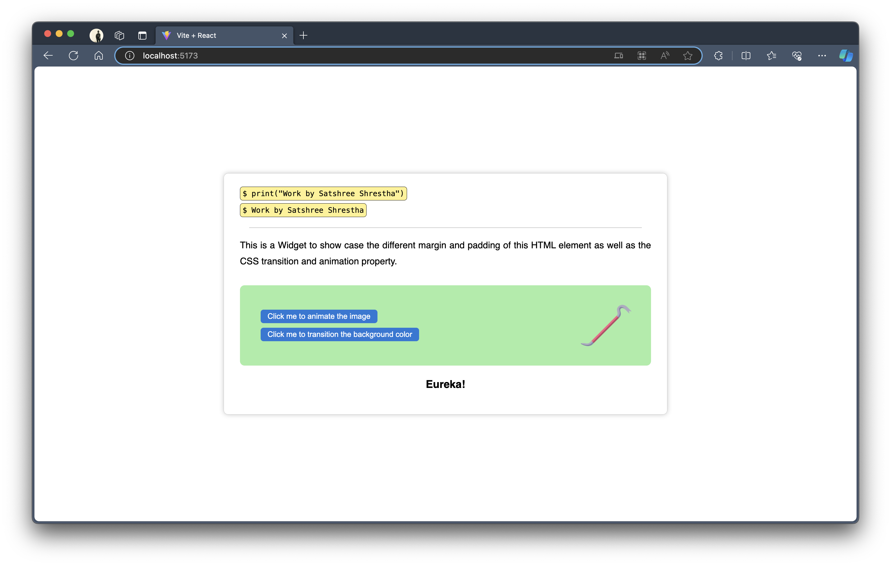

# Task 3

<strong>Work by Satshree Shrestha</strong>

## Simple CSS Showcase

- text-align
- box-shadow
- border-radius
- :hover pseudo selector
- line-height (for line spacing)
- margin and padding with `rem` and `%`

## Complex CSS Properties Used

- keyframes
- transform [scale]
- transition [property/duration/timing-function]
- browser specific property [-moz-/-ms-/-webkit-]
- animation [name/duration/timing-function/iteration-count]

## Screenshot

  

