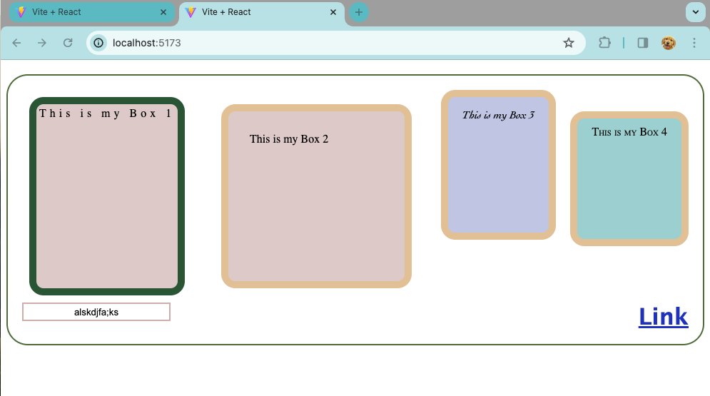

# Counter Application

This is the counter application that is built on React using the Vite project.

## Learning Things

<ul>
<li>React </li>
<li>State Mangement </li>
<li>CSS handling  </li>
<li>use of hover</li>
<li>use of animation</li>
<li>font and text properites</li>
<li>text input box</li>
<li>link with hover color change</li>
</ul>

## Screenshots

